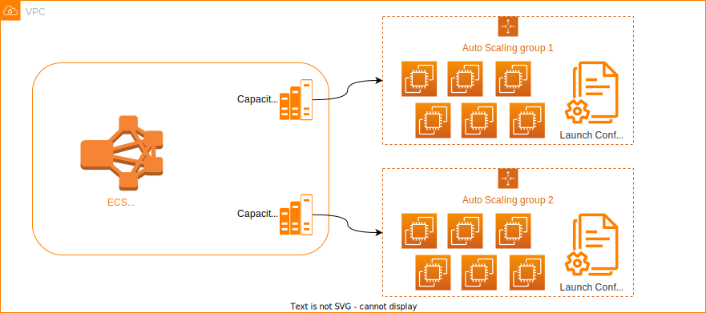

## ECS Cluster Terraform Module

Terraform module which creates Amazon ECS cluster with EC2 launch type

This module creates following resources:

1. ECS cluster
2. Capacity providers
3. Autoscaling groups for EC2
4. Launch configuration for EC2




### Usage
```hcl
module "app_cluster" {
  source       = "git::https://github.com/gaussb-labs/terraform-aws-ecs-cluster-module.git?ref=v1.1.2"
  environment  = "production"
  cluster_name = "app_cluster"
  launch_configs = [
    {
      name                      = "java_application"
      image_id                  = "ami-040d909ea4e56f8f3"
      instance_type             = "t3a.medium"
      user_data_base64          = ""
      iam_instance_profile_name = "ecs_agent_access_instance_profile"
      security_group_ids = ["sg-01", "sg-02"]
    },
    {
      name                      = "rails_application"
      image_id                  = "ami-040d909ea4e56f8f3"
      instance_type             = "t3a.medium"
      user_data_base64          = ""
      iam_instance_profile_name = "ecs_agent_access_instance_profile"
      security_group_ids = ["sg-03", "sg-04"]
    }
  ]
  asg = [
    {
      name                      = "java_application"
      vpc_zone_identifier       = ["subnet_id_1", "subnet_id_2"]
      health_check_type         = "EC2"
      health_check_grace_period = 10
      max_size                  = 3
      min_size                  = 1
      protect_from_scale_in     = true
      additional_tags           = []
    },
    {
      name                      = "rails_application"
      vpc_zone_identifier       = ["subnet_id_1", "subnet_id_2"]
      health_check_type         = "EC2"
      health_check_grace_period = 10
      max_size                  = 2
      min_size                  = 0
      protect_from_scale_in     = false
      additional_tags           = []
    }
  ]
  capacity_providers = [
    {
      name                           = "java_application"
      target_capacity                = 100
      managed_scaling_status         = "ENABLED"
      managed_termination_protection = "ENABLED"
    },
    {
      name                           = "rails_application"
      target_capacity                = 100
      managed_scaling_status         = "ENABLED"
      managed_termination_protection = "DISABLED"
    }
  ]
}
```

_NOTE:_</br>
_This module doesn't provide the ability to create ECS services and tasks.
This can be created separately and should be closer to the application deployments
rather than the infrastructure deployments._

### Configuration
#### 1. asg
asg is a list of auto-scaling group configuration. This module supports
multiple asg configurations per cluster. This is useful in scenarios where
we need different auto-scaling for different kind of workloads. 
`launch_config` is required for auto-scaling group.


#### 2. launch_configs
launch_configs is a list of launch configurations, used by the auto-scaling groups
to spin up new EC2 instances. One launch configuration per auto-scaling group is
supported, although we can specify multiple launch configurations if there are multiple
auto-scaling groups defined.
The launch configuration is linked to the auto-scaling group via the `name` attribute, 
so name has to same for both asg and launch configuration.

_`iam_instance_profile_name` is expected by this module. The instance_profile should be created considering 
the accesses needed by the ECS agent to interact with the ECS cluster and service._ 


#### 3. capacity_providers
Configuration block for defining capacity providers in the ECS cluster. 
This is needed if you plan to use capacity provider strategy for ECS service.
`asg` and `launch_config` are required for the capacity provider.


## Requirements

| Name | Version |
|------|---------|
| <a name="requirement_terraform"></a> [terraform](#requirement\_terraform) | \>= 1.2.0 |
| <a name="requirement_aws"></a> [aws](#requirement\_aws) | ~> 4.16 |
| <a name="requirement_cloudinit"></a> [cloudinit](#requirement\_cloudinit) | \>=2.2.0 |

## Providers

| Name | Version |
|------|---------|
| <a name="provider_aws"></a> [aws](#provider\_aws) | ~> 4.16 |

## Modules

No modules.

## Resources

| Name | Type |
|------|------|
| [aws_autoscaling_group.ecs_cluster_asg](https://registry.terraform.io/providers/hashicorp/aws/latest/docs/resources/autoscaling_group) | resource |
| [aws_ecs_capacity_provider.capacity_providers](https://registry.terraform.io/providers/hashicorp/aws/latest/docs/resources/ecs_capacity_provider) | resource |
| [aws_ecs_cluster.ecs_cluster](https://registry.terraform.io/providers/hashicorp/aws/latest/docs/resources/ecs_cluster) | resource |
| [aws_ecs_cluster_capacity_providers.ecs_cluster_capacity_provider](https://registry.terraform.io/providers/hashicorp/aws/latest/docs/resources/ecs_cluster_capacity_providers) | resource |
| [aws_launch_configuration.ecs_launch_config](https://registry.terraform.io/providers/hashicorp/aws/latest/docs/resources/launch_configuration) | resource |

### Inputs

| Name                                              	| Description                                                                                                                                 	| Type           	| Default 	| Required 	|
|---------------------------------------------------	|---------------------------------------------------------------------------------------------------------------------------------------------	|----------------	|---------	|----------	|
| environment                                       	| The cluster deployment environment. environment is added as prefix to the resources generated by this module.                               	| `string`       	| n/a     	| yes      	|
| cluster_name                                      	| Name of ECS cluster. environment is not added to the cluster name.                                                                          	| `string`       	| n/a     	| yes      	|
| capacity_providers                                	| List of capacity provider configuration.                                                                                                    	| `list(object)` 	| n/a     	| yes      	|
| capacity_providers.name                           	| Capacity provider name. This is used by the module to link auto-scaling group, launch configuration and capacity provider.                  	| `string`       	| n/a     	| yes      	|
| capacity_providers.target_capacity                	| Target utilisation for the capacity provider. A value between 1 and 100.                                                                    	| `number`       	| n/a     	| yes      	|
| capacity_providers.managed_scaling_status         	| Whether auto-scaling is managed by ECS. Valid values are `ENABLED` and `DISABLED`.                                                          	| `string`       	| n/a     	| yes      	|
| capacity_providers.managed_termination_protection 	| Manage container-aware termination of instances in the auto scaling group when scale-in happens. Valid values are `ENABLED` and `DISABLED`. 	| `string`       	| n/a     	| yes      	|
| asg                                               	| List of auto-scaling group configuration.                                                                                                   	| `list(object)` 	| n/a     	| yes      	|
| asg.name                                          	| Name of auto-scaling group.                                                                                                                 	| `string`       	| n/a     	| yes      	|
| asg.vpc_zone_identifier                           	| List of subnet Ids to launch resources in.                                                                                                  	| `list(string)` 	| n/a     	| yes      	|
| asg.health_check_type                             	| Controls how health check is done. Valid values are `EC2` and `ELB`.                                                                        	| `string`       	| n/a     	| yes      	|
| asg.health_check_grace_period                     	| Time in seconds after instance comes up and health check first kicks in.                                                                    	| `number`       	| n/a     	| yes      	|
| asg.max_size                                      	| The maximum capacity auto-scaling group can scale-out to.                                                                                   	| `number`       	| n/a     	| yes      	|
| asg.min_size                                      	| The minimum capacity auto-scaling group can scale-in to.                                                                                    	| `number`       	| n/a     	| yes      	|
| asg.protect_from_scale_in                         	| Indicates whether newly launched instances are automatically protected from termination by auto-scaling group when scaling in.              	| `bool`         	| n/a     	| yes      	|
| asg.additional_tags                               	| List of additional tags.                                                                                                                    	| `list(object)` 	| n/a     	| yes      	|
| asg.additional_tags.key                           	| Key of the tag.                                                                                                                             	| `string`       	| n/a     	| yes      	|
| asg.additional_tags.value                         	| Value of the tag.                                                                                                                           	| `string`       	| n/a     	| yes      	|
| asg.additional_tags.propagate_at_launch           	| Indicates whether to propagate the tag to the newly launched EC2 instances.                                                                 	| `bool`         	| n/a     	| yes      	|
| launch_configs                                    	| List of launch configurations for auto-scaling groups.                                                                                      	| `list(object)` 	| n/a     	| yes      	|
| launch_configs.name                               	| Name of the launch configuration. Should be same as corresponding auto-scaling group name.                                                  	| `string`       	| n/a     	| yes      	|
| launch_configs.image_id                           	| AMI Id of the image to use.                                                                                                                 	| `string`       	| n/a     	| yes      	|
| launch_configs.instance_type                      	| The type of EC2 instance to use. Eg: t3.small                                                                                               	| `string`       	| n/a     	| yes      	|
| launch_configs.user_data_base64                   	| Base64 encoded userdata.                                                                                                                    	| `string`       	| n/a     	| yes      	|
| launch_configs.iam_instance_profile_name          	| Name of the IAM instance profile to attach to the EC2 instance.                                                                             	| `string`       	| n/a     	| yes      	|
| launch_configs.security_group_ids                 	| List of security group ids to attach to the EC2 instance.                                                                                   	| `list(string)` 	| n/a     	| yes      	|


### Outputs
No outputs.

### License
MIT Licensed. See [LICENSE](https://github.com/gaussb-labs/terraform-aws-ecs-cluster-module/blob/main/LICENSE) for full details.
